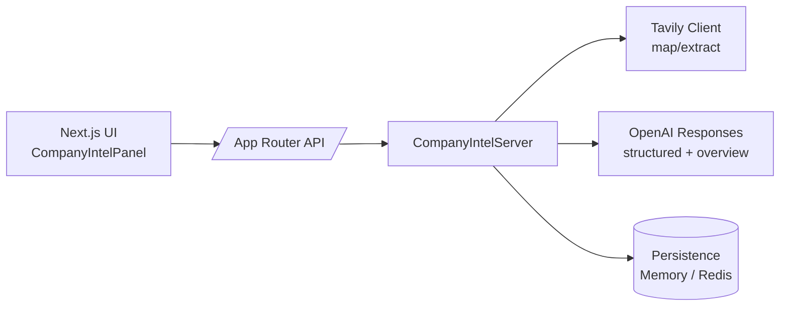

# Company-Intel Starter Architecture

## 1. Overview

The starter is a full-stack Next.js application that lets teams run end-to-end company intelligence collections:

```
map → scrape → structured outputs → overview → SSE stream → persist → export PDF
```

The stack emphasises strict TypeScript contracts, streaming UX, and pluggable persistence so the demo works out of the box (in-memory) while remaining production-ready when pointed at Redis.

## 2. High-Level Topology



- **Runtime:** Node.js (App Router `route.ts` handlers set `runtime = 'nodejs'`).
- **Streaming:** Server-Sent Events (`text/event-stream`) with `[DONE]` terminator.
- **Validation:** All LLM outputs validated using `zod` schemas.

## 3. Module Boundaries

| Module | Path | Responsibility |
| --- | --- | --- |
| UI | `components/company-intel/**`, `app/**` | React components, hooks, and Query bindings. UI never imports server code directly. |
| API | `app/api/**` | Next.js route handlers that adapt HTTP → server methods. Handles validation, SSE framing, sanitisation. |
| Server | `server/**` | Domain orchestration (`createCompanyIntelServer`), Tavily + OpenAI integrations, persistence contract, PDF generation. |
| Vendor shims | `components/ui/**`, `lib/{config.ts,logging.ts}` | Public replacements for previous internal packages (`logging`, `config`, `ui/*`). |

Interaction rules:

- UI ↔ API via HTTP fetchers defined in `CompanyIntelClientProvider`.
- API ↔ Server via `getCompanyIntelEnvironment()` which wires persistence + third-party clients.
- Persistence implementations (`memory`, `redis`) satisfy the shared `CompanyIntelPersistence` interface.

## 4. Persistence

`CompanyIntelPersistence` contract (`server/services/persistence.ts`) defines storage operations for profiles, snapshots, and page records.

- **Memory:** `server/persistence/memory.ts` – default in-memory store for local demos/tests. Keeps records in Maps with ISO serialisation.
- **Redis:** `server/persistence/redis.ts` – optional production backend (enabled by `REDIS_URL`). Uses namespaced keys:
  - `ci:profile:<teamId>`
  - `ci:snapshot:<id>`
  - `ci:snapshot-pages:<id>`
  - `ci:snapshots:byTeam:<teamId>`

The bootstrap picks Redis automatically when `REDIS_URL` is present; otherwise memory is used.

## 5. Public API Contract

All endpoints live under `/api/company-intel`.

| Method | Path | Description |
| --- | --- | --- |
| `GET` | `/` | Returns `{ data: { profile, snapshots } }` with ISO timestamps. |
| `PATCH` | `/` | Applies profile updates (company name, tagline, overview, industries, value props, key offerings). |
| `POST` | `/preview` | Maps a domain and returns selectable URLs before scraping. |
| `POST` | `/` | Triggers a run. JSON → `{ data: result }`; SSE (`Accept: text/event-stream`) streams contract events then `[DONE]`. |
| `GET` | `/snapshots/:id/export` | Streams snapshot PDF with `Content-Disposition: attachment`. |

### SSE Event Sequence

Each frame is formatted `data: { ... }\n\n` with the terminal frame `data: [DONE]\n\n`.

1. `snapshot-created` `{ status }`
2. `status` `{ stage, completed?, total? }`
3. `structured-delta` `{ delta, accumulated, summary? }`
4. `structured-reasoning-delta` `{ delta, headline? }`
5. `structured-complete` `{ payload }`
6. `overview-delta` `{ delta, displayText? }`
7. `overview-reasoning-delta` `{ delta, headline? }`
8. `overview-complete` `{ overview, headline? }`
9. `run-complete` `{ result }`
10. `run-error` `{ message }`

## 6. Bootstrap Flow

`server/bootstrap.ts` centralises dependency wiring:

1. Resolve logger (`lib/logging`).
2. Choose persistence (Redis if `REDIS_URL`, else memory).
3. Instantiate OpenAI client (Responses API, configurable via env).
4. Instantiate Tavily client (requires `TAVILY_API_KEY`).
5. Create `CompanyIntelServer` with defaults (`gpt-5` reasoning models unless overridden).

`getCompanyIntelEnvironment()` caches the singleton for reuse across route handlers; `resetCompanyIntelEnvironment()` is available for tests.

## 7. Front-End Notes

- `app/page.tsx` renders a hero header and wraps `CompanyIntelPanel` with `CompanyIntelProviders` (TanStack Query + feature client context).
- UI components rely on Tailwind (`tailwind.config.ts`) and shadcn-style vendor shims under `components/ui/*`.
- Streaming state is handled by `useCompanyIntelWorkflow`, which processes SSE frames into user-facing drafts.

## 8. Testing & CI

- Tests live under `app/api/__tests__`, `server/__tests__`, and co-located component tests, using Vitest.
- Coverage includes schema validation, SSE framing, and persistence parity (memory vs redis mock).
- GitHub Actions workflow runs `pnpm install`, `lint`, `typecheck`, `test`, `build`, and `pnpm scan` (gitleaks).

## 9. Configuration Summary

Required environment variables (see `.env.example`):

```
OPENAI_API_KEY=
TAVILY_API_KEY=
OPENAI_MODEL_STRUCTURED=gpt-5
OPENAI_MODEL_OVERVIEW=gpt-5
REDIS_URL=
ALLOW_ORIGINS=http://localhost:3000
```

The demo works with only `OPENAI_API_KEY` and `TAVILY_API_KEY` set; Redis becomes active as soon as `REDIS_URL` is non-empty.
