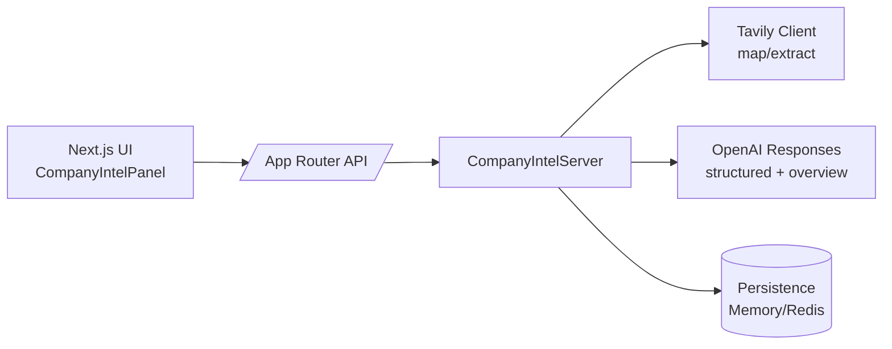

# Company-Intel Starter — Architecture

## 1) Objectives (non-negotiables)

* End-to-end: **map → scrape → structured outputs → overview → SSE → persist**.
* Public-ready TS repo (no private `@agenai/*` deps).
* **Next.js App Router** APIs with **SSE**; one demo page.
* **Memory persistence** by default; **Redis** optional via `REDIS_URL`.
* Clean ENV, logging, retries, timeouts; small but real tests; CI passes.

---

## 2) High-level system



**Runtime:** Node (not Edge).
**Streaming:** SSE frames (`text/event-stream`) with `[DONE]` terminator.
**Typing:** strict TS + zod validation for all LLM outputs.

---

## 3) Modules & boundaries

**Client (UI):** `components/company-intel/**`

* React Query hooks call the API; UI shows streaming draft & saved snapshots.

**API (App Router):** `app/api/company-intel/**`

* GET profile/snapshots, POST preview, POST trigger (SSE), GET export PDF.

**Server (Domain):** `server/**`

* `createCompanyIntelServer(config)` wires Tavily + OpenAI + Persistence.
* `services/runCollection.ts` orchestrates full run and emits events.
* `agents/**` call OpenAI Responses (zod-validated).
* `tavily/**` maps/extracts pages.
* `persistence/**` implements the storage contract.

**Vendors/Shims:** `components/ui/**`, `lib/{config.ts,logging.ts}`

* `logging.ts`, `config.ts`, `ui/*` small wrappers (replace private deps).

**Rule:** UI ↔ API ↔ Server. UI must not import Server directly. All cross-module traffic uses typed DTOs.

---

## 4) Public API contracts

### 4.1 Endpoints

* `GET /api/company-intel`
  → `{ data: { profile: CompanyProfile|null, snapshots: CompanyProfileSnapshot[] } }`

* `PATCH /api/company-intel`
  Body subset of: `{ overview?, companyName?, tagline?, primaryIndustries?, valueProps?, keyOfferings? }`
  → `{ data: CompanyProfile }`

* `POST /api/company-intel/preview`
  Body: `{ domain: string, options? }`
  → `{ data: CompanyIntelPreviewResult }`

* `POST /api/company-intel`

  * If `Accept: text/event-stream` → **SSE stream** (see 4.2) then `[DONE]`
  * Else → `{ data: TriggerCompanyIntelResult }`

* `GET /api/company-intel/snapshots/:id/export`
  → `application/pdf` with `Content-Disposition: attachment; filename=...`

### 4.2 SSE events (each frame = `data: <json>\n\n`)

Event `type` values:

* `snapshot-created` `{ status }`
* `status` `{ stage: 'mapping'|'scraping'|'analysis_structured'|'analysis_overview'|'persisting', completed?, total? }`
* `structured-delta` `{ delta, accumulated, summary? }`   // partial JSON & parsed summary if available
* `structured-reasoning-delta` `{ delta, headline? }`
* `structured-complete` `{ payload: { structuredProfile, metadata, faviconUrl?, reasoningHeadline? } }`
* `overview-delta` `{ delta, displayText? }`
* `overview-reasoning-delta` `{ delta, headline? }`
* `overview-complete` `{ overview, headline? }`
* `run-complete` `{ result }`
* `run-error` `{ message }`
* **Terminal:** `[DONE]`

**Headers:** `Content-Type: text/event-stream`, `Cache-Control: no-cache, no-transform`, `Connection: keep-alive`, `X-Accel-Buffering: no`.

---

## 5) Data contracts (essentials)

```ts
// Profile + snapshot (client types used across UI/API)
type CompanyProfileStatus = 'not_configured'|'pending'|'ready'|'failed';
type CompanyProfileSnapshotStatus = 'pending'|'complete'|'failed';

type CompanyProfileKeyOffering = { title: string; description?: string };

type CompanyProfile = {
  id: number; teamId: number; domain: string|null; status: CompanyProfileStatus;
  companyName: string|null; tagline: string|null; overview: string|null;
  valueProps: string[]; keyOfferings: CompanyProfileKeyOffering[]; primaryIndustries: string[];
  faviconUrl: string|null; lastSnapshotId: number|null; lastRefreshedAt: Date|null;
  lastError: string|null; createdAt: Date; updatedAt: Date;
};

type CompanyIntelSnapshotStructuredProfileSummary = {
  companyName?: string|null; tagline?: string|null; valueProps: string[];
  keyOfferings: CompanyProfileKeyOffering[]; primaryIndustries: string[];
  sources: { page: string; url: string; rationale?: string }[];
};

type CompanyIntelSnapshotSummaries = {
  structuredProfile?: CompanyIntelSnapshotStructuredProfileSummary;
  overview?: string|null;
  metadata?: {
    structuredProfile?: { responseId?: string; model?: string; usage?: any; rawText?: string; headline?: string; summary?: string };
    overview?: { responseId?: string; model?: string; usage?: any; rawText?: string; headline?: string; summary?: string };
  };
  pagesXml?: string|null;
};

type CompanyProfileSnapshot = {
  id: number; teamId: number; domain: string|null; status: CompanyProfileSnapshotStatus;
  selectedUrls: string[]; mapPayload: unknown; summaries: CompanyIntelSnapshotSummaries|null;
  rawScrapes: { url: string; success: boolean; durationMs: number; response?: any; error?: { name:string; message:string } }[];
  initiatedByUserId: number|null; error: string|null; createdAt: Date; completedAt: Date|null;
};
```

---

## 6) Persistence contract

`CompanyIntelPersistence` (already defined). Provide **memory** impl as default; optional **redis** with keys:

* `ci:profile:<teamId>`
* `ci:snapshot:<id>`
* `ci:snapshots:byTeam:<teamId>` (sorted newest→oldest ids)

**Rule:** normalize Dates to ISO at serialize boundaries; parse on read.

---

## 7) Agents (OpenAI Responses)

* Use **Responses API** with **zod** (`zodTextFormat`) for:

  * **Structured profile** → `CompanyIntelStructuredOutputSchema` (strict)
  * **Overview** → `{ overview: string }` min length enforced
* **Streaming:** attach listeners:

  * `response.output_text.delta` → buffer JSON; attempt early parse; emit `structured-delta` / `overview-delta`
  * `response.reasoning_summary_text.delta` → emit `*-reasoning-delta` + rolling headline
* **Fallback:** If SDK variant lacks `zodTextFormat`, request JSON schema and validate with zod afterward.

**Timeouts/Retries:** set via OpenAI client options (e.g., 120s, 2 retries).

---

## 8) API route responsibilities

* **preview/route.ts (POST):** `server.preview(domain, options)` → `{ data: preview }`
* **route.ts (GET):** `server.getProfile(teamId)` + `server.getSnapshotHistory(teamId, 5)`
* **route.ts (PATCH):** sanitize payload, `server.updateProfile({ teamId, updates, initiatedByUserId })`
* **route.ts (POST):**

  * If `Accept: text/event-stream`: create `ReadableStream`, subscribe `onEvent`, write frames; close with `[DONE]`.
  * Else: await `runCollection` and return JSON.
* **snapshots/[id]/export/route.ts (GET):** `server.generateSnapshotPdf` → `application/pdf`.

---

## 9) Errors & resilience

* Tavily 429s → exponential backoff (already implemented).
* Emit `run-error` on fatal; still update snapshot/profile to `failed`.
* Always end SSE with **either** `run-error` **or** `[DONE]`. No silent ends.

---

## 10) Configuration (ENV)

```
OPENAI_API_KEY=...
TAVILY_API_KEY=...
OPENAI_MODEL_STRUCTURED=gpt-5
OPENAI_MODEL_OVERVIEW=gpt-5
REDIS_URL=
ALLOW_ORIGINS=http://localhost:3000
```

---

## 11) Observability

* JSON-ish logs for each phase: mapping, scraping progress (n/N), structured start/complete, overview start/complete, persist.
* Capture OpenAI `responseId`, `model`, `usage` in metadata.
* (Optional) add request correlation id; include in SSE frames.

---

## 12) Security & guardrails

* Never echo secrets; only `.env.example`.
* Sanitize/validate PATCH input; trim strings; cap list sizes.
* Restrict preview/trigger to same domain (manual URLs must belong to mapped host).
* CORS: same origin; if needed, read `ALLOW_ORIGINS`.

---

## 13) Performance & cost

* Limit `maxPages` (default 10).
* Short timeouts for map/extract; parallelize extracts but cap concurrency.
* Cache preview for the same domain for a short window (optional).

---

## 14) Testing

* **Unit:** serializers/zod, URL ranking, favicon extraction.
* **Integration:** SSE route writes correct sequence & `[DONE]`.
* **Parity:** memory vs redis basic operations.
* **Golden path:** map → select → stream → complete → export.

---

## 15) CI/CD

* Workflow: `typecheck`, `lint`, `test`, `build`, `gitleaks`.
* Require PR checks. No `.env*` or secrets in repo history.

---

## 16) Extension points

* Pluggable retrievers (swap Tavily).
* Vector DB & hybrid retrieval.
* Additional agents (competitor compare, pricing grid).
* Multi-tenant auth around the same contracts.

---

## 17) Code standards

* Strict TS. No `any` in exported types.
* Module boundaries: UI modules under `components/company-intel` never import `server` directly.
* Public contracts in `components/company-intel/types` are the source of truth.
* Keep files small, pure functions where possible, no side-effects in type modules.

---

## 18) Demo page

Mount:

```tsx
// app/page.tsx
import { CompanyIntelPanel, CompanyIntelProviders } from '@/components/company-intel';
export default function Page(){
  return (
    <CompanyIntelProviders teamId={1}>
      <main className="p-6">
        <CompanyIntelPanel />
      </main>
    </CompanyIntelProviders>
  );
}
```

---

## 19) ADRs (stubs)

* **ADR-0001:** Use SSE over WebSockets for simplicity + streaming.
* **ADR-0002:** Memory persistence default; Redis optional by `REDIS_URL`.
* **ADR-0003:** Validate LLM outputs with zod; never trust raw JSON.
* **ADR-0004:** Next.js App Router on Node runtime (no Edge) to support SSE and libs.

---

## 20) Done criteria

* Local demo: map, select, stream, snapshot persisted, export PDF works.
* No private deps; CI green; secrets scan clean.
