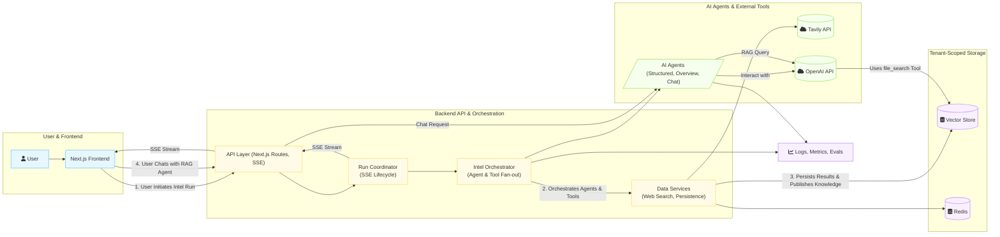

```mermaid
graph LR
    subgraph User & Frontend
        U[fa:fa-user User] --> FE(Next.js Frontend)
    end

    subgraph "Backend API & Orchestration"
        API["API Layer (Next.js Routes, SSE)"]
        Coordinator["Run Coordinator <br/>(SSE Lifecycle)"]
        Orchestrator["Intel Orchestrator <br/>(Agent & Tool Fan-out)"]
        DataServices["Data Services <br/>(Web Search, Persistence)"]
    end

    subgraph "AI Agents & External Tools"
        Agents[/"AI Agents <br/>(Structured, Overview, Chat)"/]
        Tavily[("fa:fa-cloud Tavily API")]
        OpenAI[("fa:fa-cloud OpenAI API")]
    end

    subgraph "Tenant-Scoped Storage"
        direction TB
        VectorStore[("fa:fa-database Vector Store")]
        Redis[("fa:fa-database Redis")]
    end

    Obs["fa:fa-chart-line Logs, Metrics, Evals"]

    %% --- Key Flows ---
    FE -- "1. User Initiates Intel Run" --> API
    API --> Coordinator
    Coordinator --> Orchestrator

    Orchestrator -- "2. Orchestrates Agents & Tools" --> DataServices
    Orchestrator --> Agents
    
    DataServices --> Tavily
    Agents -- Interact with --> OpenAI

    DataServices -- "3. Persists Results & Publishes Knowledge" --> VectorStore
    DataServices --> Redis
    
    Coordinator -- SSE Stream --> API
    API -- SSE Stream --> FE

    FE -- "4. User Chats with RAG Agent" --> API
    API -- Chat Request --> Agents
    Agents -- RAG Query --> OpenAI
    OpenAI -- Uses file_search Tool --> VectorStore
    
    %% --- Observability ---
    Orchestrator --> Obs
    Agents --> Obs

    %% --- Styling ---
    classDef frontend fill:#e6f7ff,stroke:#91d5ff,stroke-width:2px;
    classDef backend fill:#fffbe6,stroke:#ffe58f,stroke-width:2px;
    classDef agents fill:#f6ffed,stroke:#b7eb8f,stroke-width:2px;
    classDef storage fill:#f9f0ff,stroke:#d3adf7,stroke-width:2px;
    
    class U,FE frontend;
    class API,Coordinator,Orchestrator,DataServices backend;
    class Agents,Tavily,OpenAI agents;
    class VectorStore,Redis,Obs storage;
```