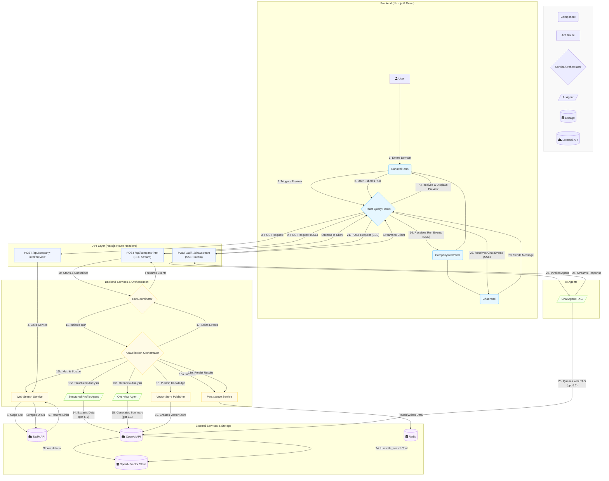

```mermaid
graph TD
    subgraph legend [ ]
        direction LR
        A1(Component)
        A2[API Route]
        A3{Service/Orchestrator}
        A4[/AI Agent/]
        A5[(fa:fa-database Storage)]
        A6[(fa:fa-cloud External API)]
        style legend fill:#f9f9f9,stroke:#ddd,stroke-width:1px
    end
    
    U[fa:fa-user User]

    subgraph "Frontend (Next.js & React)"
        direction TB
        UI_Panel(CompanyIntelPanel)
        UI_Form(RunIntelForm)
        UI_Chat(ChatPanel)
        UI_DataLayer{React Query Hooks}

        U -- 1. Enters Domain --> UI_Form
        UI_Panel --- UI_Form
        UI_Panel --- UI_Chat
        UI_Form -- "2. Triggers Preview" --> UI_DataLayer
        UI_DataLayer -- "7. Receives & Displays Preview" --> UI_Form
        UI_Form -- "8. User Submits Run" --> UI_DataLayer
        UI_DataLayer -- "16. Receives Run Events (SSE)" --> UI_Panel
        UI_Chat -- "20. Sends Message" --> UI_DataLayer
        UI_DataLayer -- "26. Receives Chat Events (SSE)" --> UI_Chat
    end

    subgraph "API Layer (Next.js Route Handlers)"
        direction TB
        API_Preview["POST /api/company-intel/preview"]
        API_Run["POST /api/company-intel <br/>(SSE Stream)"]
        API_Chat["POST /api/.../chat/stream <br/>(SSE Stream)"]
    end

    subgraph "Backend Services & Orchestration"
        direction TB
        Coordinator{RunCoordinator}
        Orchestrator{runCollection Orchestrator}
        WebSearch[Web Search Service]
        Persistence[Persistence Service]
        VectorPublisher[Vector Store Publisher]
        
        Orchestrator -- "13a. Initialise" --> Persistence
        Orchestrator -- "13b. Map & Scrape" --> WebSearch
        Orchestrator -- "13c. Structured Analysis" --> Agent_Struct
        Orchestrator -- "13d. Overview Analysis" --> Agent_Overview
        Orchestrator -- "13e. Persist Results" --> Persistence
        Orchestrator -- "18. Publish Knowledge" --> VectorPublisher
    end

    subgraph "AI Agents"
        direction TB
        Agent_Struct[/"Structured Profile Agent"/]
        Agent_Overview[/"Overview Agent"/]
        Agent_Chat[/"Chat Agent RAG"/]
    end

    subgraph "External Services & Storage"
        direction TB
        TavilyAPI[(fa:fa-cloud Tavily API)]
        OpenAI_API[(fa:fa-cloud OpenAI API)]
        VectorStore[(fa:fa-database OpenAI Vector Store)]
        RedisDB[(fa:fa-database Redis)]
    end

    %% --- Flow Connections ---

    %% Preview Flow
    UI_DataLayer -- "3. POST Request" --> API_Preview
    API_Preview -- "4. Calls Service" --> WebSearch
    WebSearch -- "5. Maps Site" --> TavilyAPI
    TavilyAPI -- "6. Returns Links" --> WebSearch

    %% Run Collection Flow
    UI_DataLayer -- "9. POST Request (SSE)" --> API_Run
    API_Run -- "10. Starts & Subscribes" --> Coordinator
    Coordinator -- "11. Initiates Run" --> Orchestrator
    WebSearch -- "Scrapes URLs" --> TavilyAPI
    Agent_Struct -- "14. Extracts Data <br/>(gpt-5.1)" --> OpenAI_API
    Agent_Overview -- "15. Generates Summary <br/>(gpt-5.1)" --> OpenAI_API
    
    %% Run Collection Streaming
    Orchestrator -- "17. Emits Events" --> Coordinator
    Coordinator -- "Forwards Events" --> API_Run
    API_Run -- "Streams to Client" --> UI_DataLayer
    
    %% Vector Store Flow
    VectorPublisher -- "19. Creates Vector Store" --> OpenAI_API
    OpenAI_API -- Stores data in --> VectorStore
    
    %% Chat Flow
    UI_DataLayer -- "21. POST Request (SSE)" --> API_Chat
    API_Chat -- "22. Invokes Agent" --> Agent_Chat
    Agent_Chat -- "23. Queries with RAG <br/>(gpt-5.1)" --> OpenAI_API
    OpenAI_API -- "24. Uses file_search Tool" --> VectorStore
    Agent_Chat -- "25. Streams Response" --> API_Chat
    API_Chat -- "Streams to Client" --> UI_DataLayer
    
    %% Persistence
    Persistence -- "Reads/Writes Data" --> RedisDB

    %% Styling
    classDef frontend fill:#e6f7ff,stroke:#91d5ff,stroke-width:2px;
    classDef api fill:#f0f5ff,stroke:#adc6ff,stroke-width:2px;
    classDef backend fill:#fffbe6,stroke:#ffe58f,stroke-width:2px;
    classDef agents fill:#f6ffed,stroke:#b7eb8f,stroke-width:2px;
    classDef externals fill:#f9f0ff,stroke:#d3adf7,stroke-width:2px;
    
    class UI_Panel,UI_Form,UI_Chat,UI_DataLayer frontend;
    class API_Preview,API_Run,API_Chat api;
    class Coordinator,Orchestrator,WebSearch,Persistence,VectorPublisher backend;
    class Agent_Struct,Agent_Overview,Agent_Chat agents;
    class TavilyAPI,OpenAI_API,VectorStore,RedisDB externals;
```